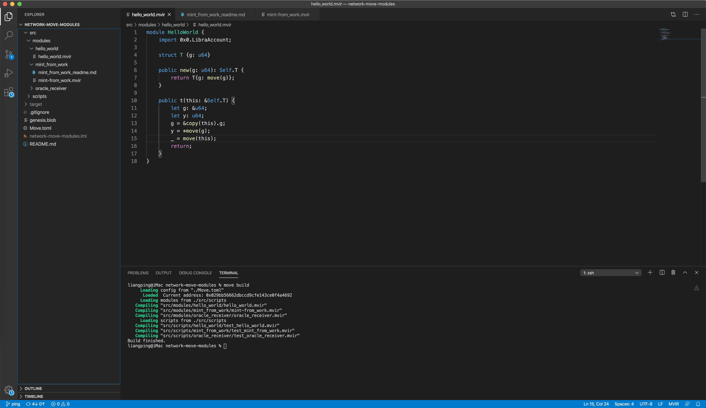

# Integrate with IDE

## Integrate with Visual Source Code

* Open Move Project

if you did NOT have a Move Project, you can create one by following [Quick Start](01_quick_start.md) 

* Open a Terminal in VS Code.



* Run Commands in Terminal.

```
$move build
```
or
```
$move test
```
